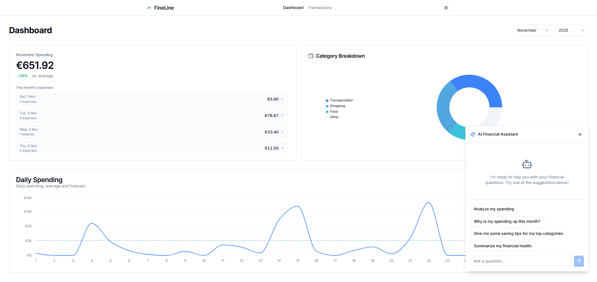
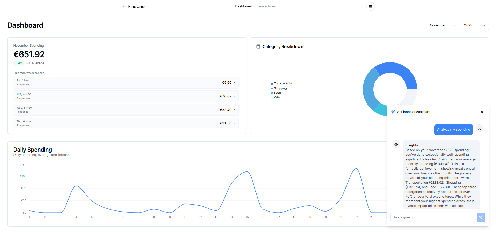
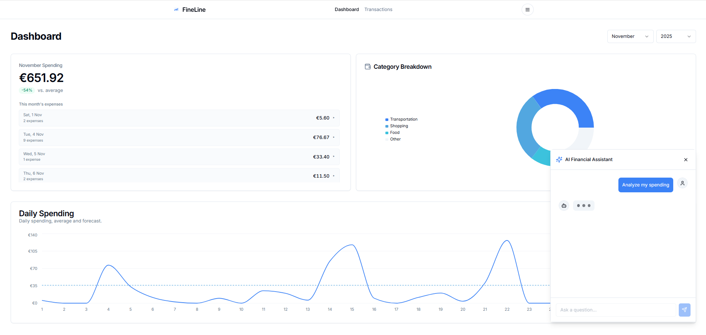
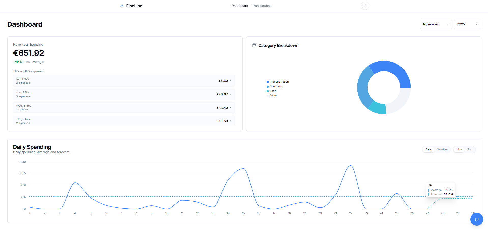
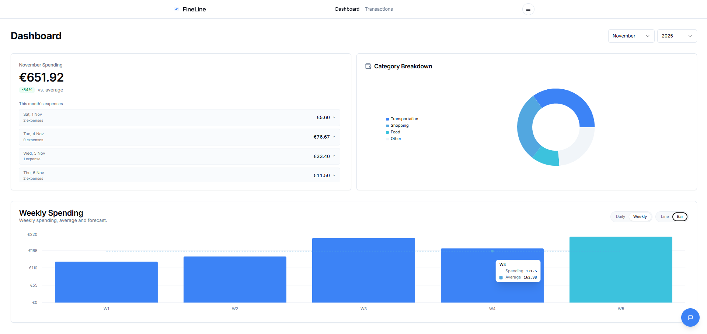
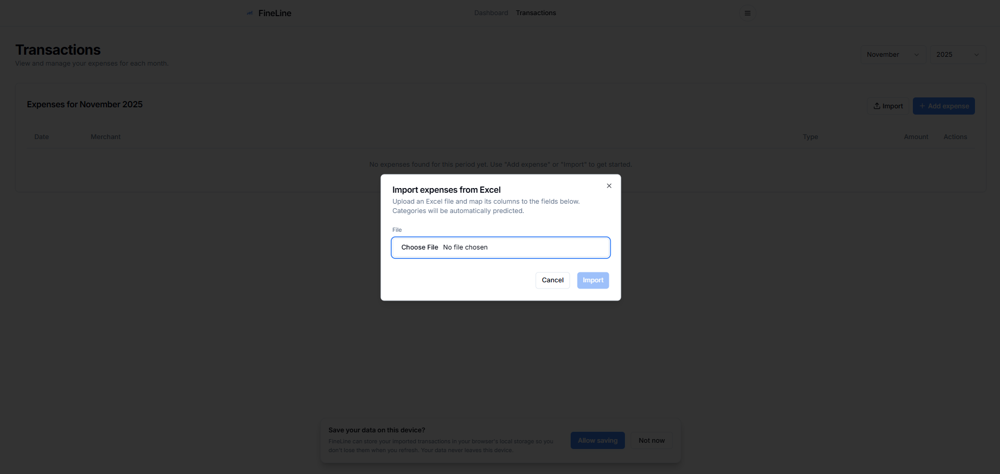
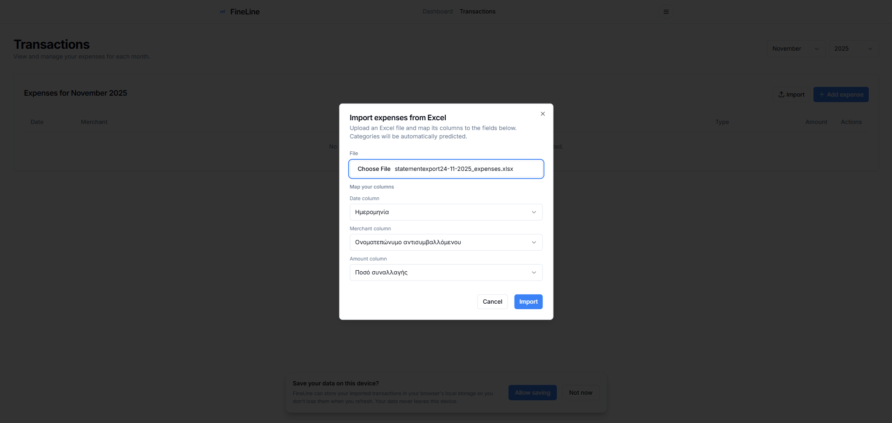
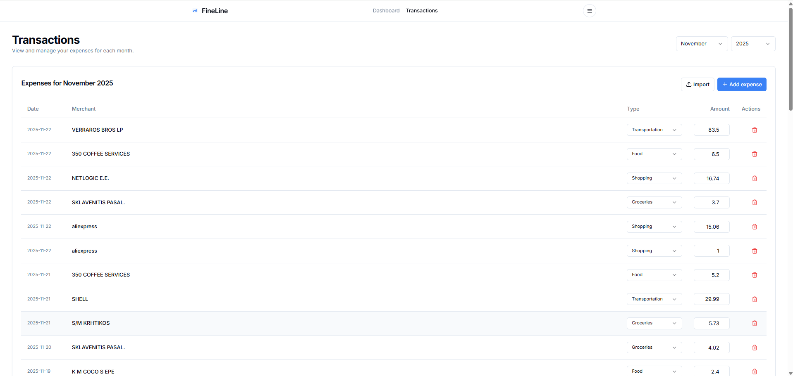
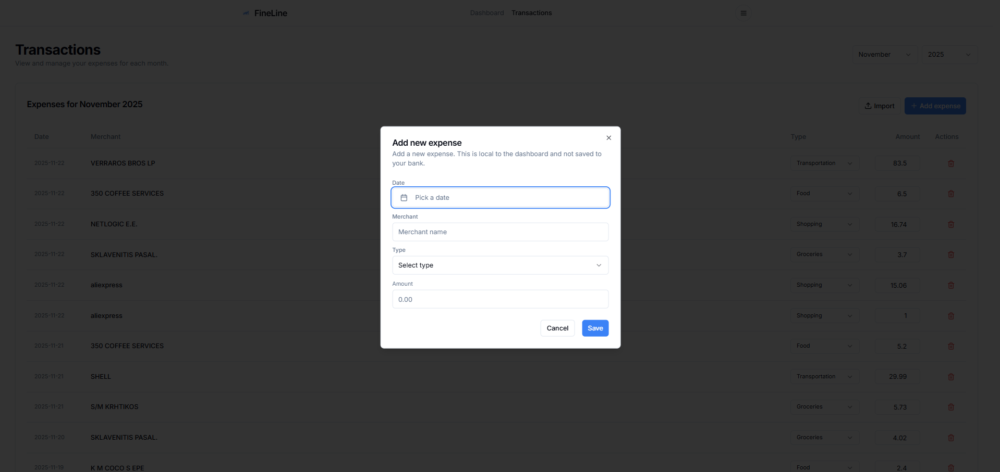

# Fineline – AI-Powered Personal Finance Dashboard

Fineline is a personal finance dashboard that helps you understand, analyze and forecast your spending. It classifies bank transactions with a fine-tuned BERT model, forecasts monthly spending, and uses an LLM-powered assistant to provide natural-language insights and budgeting tips.
---

### Dashboard and AI Assistant

Main dashboard with daily spending and the AI assistant opened:

AI assistant answering a financial question:

AI assistant while generating a response:

### Forecasts and Trends

Daily spending with trend and forecast for the rest of the month:

Weekly spending overview with bar chart and forecast:

### Transactions and Import Flow

Importing transactions from Excel/CSV, initial dialog:

Import dialog after selecting a file and detecting columns:

Transactions view populated with imported and categorized expenses:

Manually adding an expense:

---

## Core Features

### Transaction Management

* Import transactions from Excel/CSV with column mapping for date, merchant and amount
* Duplicate detection based on date, merchant and amount with options to:
  * Add all
  * Skip duplicates
  * Cancel the import
* Manual addition and deletion of transactions

### Smart Categorization

* Automatic transaction categorization using a fine-tuned BERT classifier
* Reuse of existing merchant categories to avoid unnecessary re-classifications
* Backend caching so repeated descriptions do not need to be classified more than once

### Spending Analytics and Forecasting

* Daily and weekly spending views
* Line and bar chart modes with end-of-month forecasting
* Average spending line to benchmark your activity
* A regression-based forecast that projects spending to the end of the month

### AI Financial Assistant

* Chat-style assistant embedded in the dashboard
* Can summarize your monthly financial health, highlight key categories and propose saving strategies
* Uses flows for:

  * Answering free-form financial questions over your current month
  * Analyzing your category breakdown and suggesting improvements
* Works with:

  * An environment API key, or
  * A per-session Gemini API key entered and verified by the user in the UI

---

## Getting Started (High Level)

1. Run the backend service for transaction categorization (FastAPI with a fine-tuned BERT model).
2. Run the Next.js front-end and open the dashboard.
3. Import your bank statement (Excel/CSV) and confirm the column mapping.
4. Review the categorized transactions and adjust anything manually if needed.
5. Open the AI assistant, provide a Gemini API key if required, and start asking financial questions about your data.

---

## License

Choose and specify your license here (for example, MIT).
